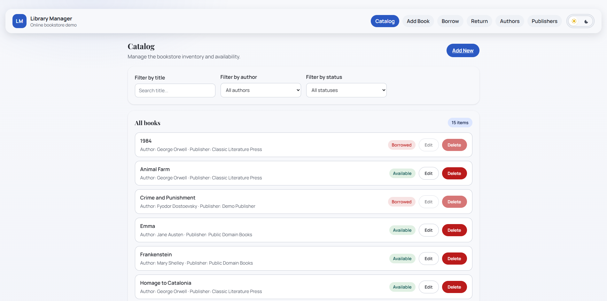

## 📚 LibraryManager


A full-stack application for managing a library system, built with ASP.NET Core (Web API), React, and PostgreSQL. It supports managing books, authors, and publishers with a dedicated web UI. This project is for study and learning purposes.



> The database is automatically seeded with demo data (authors and 15 books) to showcase pagination, borrowing state, and catalog browsing.

---

## 🚀 Features

- 📖 Create, edit, and delete books
- 👩‍💼 Create, list, and delete authors and publishers
- 📚 View available and borrowed books
- 🌗 Light and dark theme toggle
- 🔄 Borrow and return books
- ✅ Backend unit tests using xUnit
- 🐳 Dockerized frontend, backend, and PostgreSQL database setup with migrations applied automatically

## 🧩 Demo Data

On first startup, the database is automatically seeded with:
- 5 authors
- 3 publishers
- 15 classic books

This allows immediate interaction with pagination (10 items per page), borrowing state, and catalog browsing without manual setup.

---

## 🧰 Tech Stack

| Layer     | Technology                    |
|-----------|-------------------------------|
| Frontend  | React                         |
| Backend   | ASP.NET Core Web API (.NET 8) |
| Database  | PostgreSQL                    |
| Styling   | Custom CSS UI                 |
| Testing   | xUnit                         |
| DevOps    | Docker & Docker Compose       |

---

## 📂 Project Structure

```
LibraryManager/
├── backend/
│   └── LibraryManager.API/        # ASP.NET Core Web API
├── frontend/
│   └── React App                  # React SPA
├── docker-compose.yml
├── docker-compose-ci.yml
└── README.md
```

---

## ⚙️ Prerequisites

- Docker  
- Docker Compose  

> Migrations are automatically applied when the backend container starts.

(Optional, for local development and managing migrations):  
- .NET SDK

---

## 🐳 Running the Project (Docker Compose)

1. **Clone the repository**
   ```bash
   git clone https://github.com/rrocheta/LibraryManager.git
   cd LibraryManager
   ```

2. **Build and start the containers**
   ```bash
   docker-compose up --build
   ```

3. The backend container will automatically apply Entity Framework Core migrations on startup, creating the necessary database schema.

4. **Access the application**
   - Frontend: http://localhost:3000
   - Backend API (base URL): http://localhost:8080
   - Swagger UI: http://localhost:8080/swagger

---

## 🤖 CI

CI runs via GitHub Actions and uses `docker-compose-ci.yml` to build and validate the stack in a containerized setup.

---

## 🔧 Running Backend Migrations Locally

If you want to create or update migrations locally, ensure you have the EF Core CLI tools installed:

```bash
dotnet tool install --global dotnet-ef
```

To add a new migration:

```bash
dotnet ef migrations add YourMigrationName
```

To update the database locally:

```bash
dotnet ef database update
```

---

## 🔬 Running Backend Tests (xUnit)

To run backend tests locally:

1. Navigate to the test project:
   ```bash
   cd backend/LibraryManager.API.Tests
   ```

2. Run tests with the .NET CLI:
   ```bash
   dotnet test
   ```

---

## 🧪 API Endpoints (Sample)

| Method | Endpoint                 | Description                |
|--------|--------------------------|----------------------------|
| GET    | `/api/books`             | List all books             |
| GET    | `/api/authors`           | List all authors           |
| GET    | `/api/publishers`        | List all publishers        |
| POST   | `/api/books`             | Create new book            |
| POST   | `/api/authors`           | Create new author          |
| POST   | `/api/publishers`        | Create new publisher       |
| PUT    | `/api/books/{id}`        | Edit book                  |
| DELETE | `/api/books/{id}`        | Delete book                |
| DELETE | `/api/authors/{id}`      | Delete author              |
| DELETE | `/api/publishers/{id}`   | Delete publisher           |

---

## 📌 Note

This project is under active development and may evolve as new features are added and existing components are refined as part of ongoing learning and experimentation.

---

## 👨‍💻 Author

**Ricardo Rocheta**
